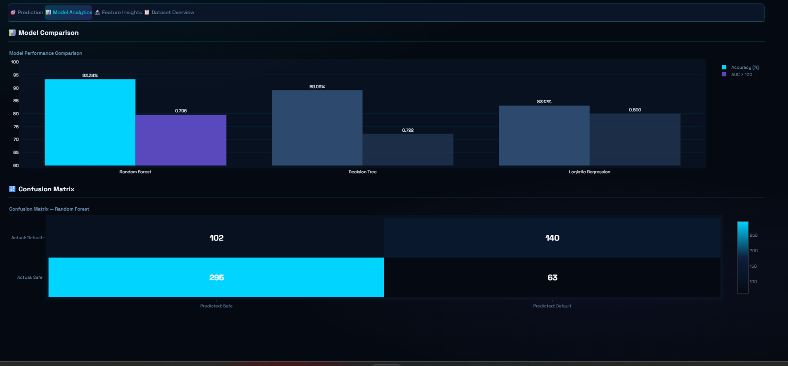
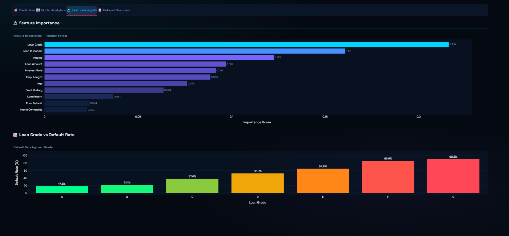
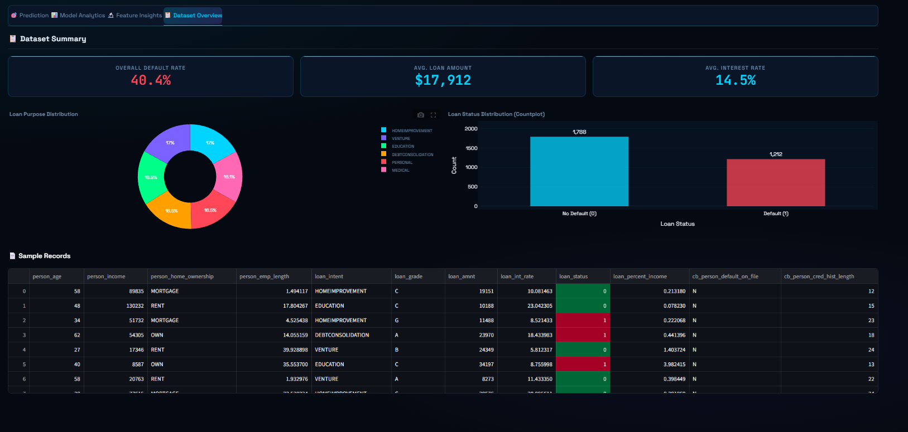
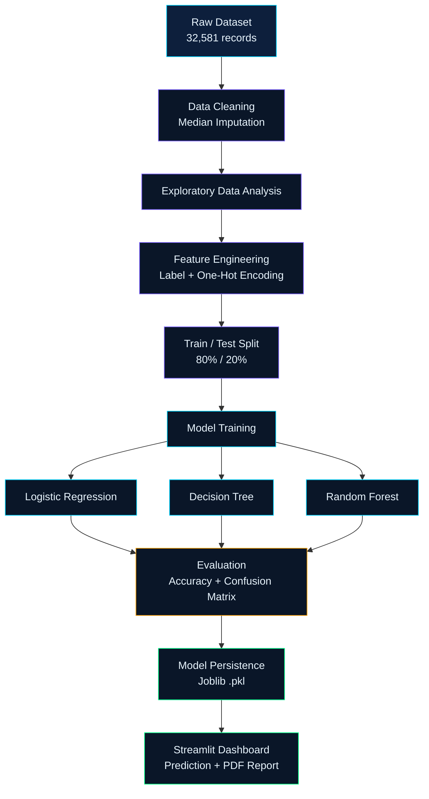
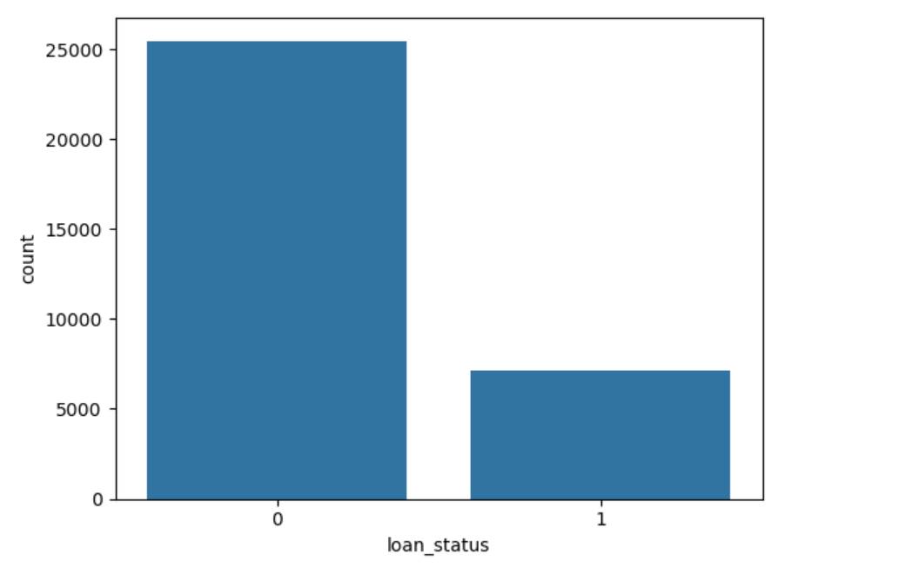
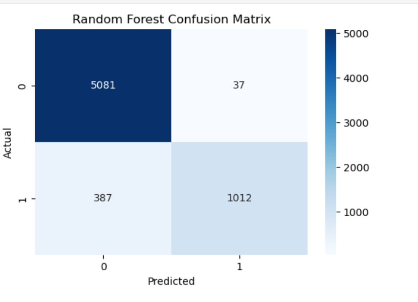
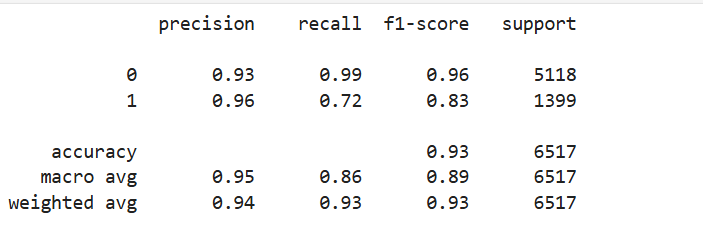

<div align="center">


### Production-ready Machine Learning Pipeline
### from Data Preprocessing to Deployment

<br/>

</div>

<br/>

## 📖 Introduction

Lending decisions come down to one high-stakes question: *will this applicant repay the loan?* **CreditSense AI** frames this as a supervised classification problem and builds a complete pipeline around it — from a raw, imperfect real-world dataset to a deployed decision-support tool.

- Manual credit assessment is slow and inconsistent at scale; a trained classifier flags risk instantly and consistently.
- Surfacing *which* factors drive a prediction (feature importance) gives a transparent, explainable basis for a decision instead of a black box.
- This mirrors the probability-of-default models banks, microfinance institutions, and fintech lenders use before extending a loan.

---

## 🌐 Live Demo

<div align="center">

[](https://credit-scoring-system-kgsxmwuhqibn6mcqvbw7rz.streamlit.app/)
[]()

</div>

---

## 🖼️ Project Preview

<div align="center">

**Dashboard Preview**


<br/><br/>

| Prediction Page | Model Analytics |
|:---:|:---:|
|  |  |

| Feature Insights | Dataset Overview |
|:---:|:---:|
|  |  |

</div>

---

## ✨ Key Features

| | | |
|:---|:---|:---|
| ✔ **Data Cleaning** — median imputation | ✔ **Feature Engineering** — Label & One-Hot Encoding | ✔ **Multi-Model Training** — LR, Decision Tree, Random Forest |
| ✔ **Model Comparison** — accuracy benchmarked | ✔ **Feature Importance** — per-model charts | ✔ **Confusion Matrix Evaluation** |
| ✔ **Real-Time Prediction** — instant verdict | ✔ **Risk Level Badges** — Low / Medium / High | ✔ **PDF Report Generation** |
| ✔ **Interactive Streamlit Dashboard** — 4 tabs | ✔ **Model Persistence** — Joblib | ✔ **Dataset Overview Tab** — live stats & charts |

---

## 🔄 Project Workflow



---

## 📂 Folder Structure

```
credit-scoring-system/
├── 📄 README.md
└── 📂 Credit_Scoring_System/
    ├── 📄 app.py                     # Streamlit dashboard (CreditSense AI)
    ├── 📄 credit_score_model.ipynb   # Cleaning, EDA, training & evaluation
    ├── 📄 requirements.txt
    ├── 📂 dataset/
    │   └── 📄 credit_risk_dataset.csv
    ├── 📂 model/
    │   └── 📄 credit_score.pkl
    └── 📂 images/
        ├── 🖼️ dataset_overview.png
        ├── 🖼️ distribution.png
        ├── 🖼️ heatmap.png
        ├── 🖼️ confusion_matrix.png
        ├── 🖼️ feature_insights.png
        ├── 🖼️ gui1.png
        ├── 🖼️ model_analytics.png
        ├── 🖼️ prdiction_page.png
        └── 🎞️ dashboard_preview.gif
```

---

## 📊 Dataset

| Detail | Value |
|---|---|
| **Source file** | `dataset/credit_risk_dataset.csv` |
| **Records** | 32,581 loan applicants |
| **Columns** | 12 (11 features + 1 target) |
| **Target column** | `loan_status` — 0 = No Default, 1 = Default |
| **Class balance** | 78.2% No Default / 21.8% Default |
| **Missing values** | `person_emp_length`: 895 · `loan_int_rate`: 3,116 |
| **Preprocessing** | Median imputation → Label Encoding (`person_home_ownership`) → Binary mapping (`cb_person_default_on_file`) → One-Hot Encoding, drop-first (`loan_intent`, `loan_grade`) |

**Feature set:** `person_age` · `person_income` · `person_home_ownership` · `person_emp_length` · `loan_intent` · `loan_grade` · `loan_amnt` · `loan_int_rate` · `loan_percent_income` · `cb_person_default_on_file` · `cb_person_cred_hist_length`

---

## 🔍 Exploratory Data Analysis

- **Class imbalance:** ~78.2% no-default vs. ~21.8% default, confirmed via `sns.countplot`.
- **Missing data:** real missingness in `person_emp_length` (895 rows) and `loan_int_rate` (3,116 rows), resolved with median imputation.
- **Correlation heatmap:** generated across numeric features to spot relationships before modeling.
- **Distribution plots:** produced for numeric fields to check spread and skew ahead of encoding.

<div align="center">

<table>
<tr>
<th align="center">📊 Distribution Analysis</th>
<th align="center">🔥 Correlation Heatmap</th>
</tr>

<tr>
<td align="center">

</td>

<td align="center">

</td>
</tr>
</table>

</div>
---

## 🧪 Machine Learning Pipeline

`Data Collection → Cleaning → Encoding → Split (80/20) → Training (LR, Decision Tree, Random Forest) → Evaluation → Deployment`

> No explicit feature scaling step exists in the notebook — all three models, including Logistic Regression, train on unscaled features (see [Future Improvements](#-future-improvements)).

---

## 🤖 Models Used

| Model | Accuracy | Status |
|---|---|:---:|
| Logistic Regression | 83.12% | ✅ |
| Decision Tree Classifier | 89.09% | ✅ |
| **Random Forest Classifier (100 trees)** | **93.34%** | 🏆 Best |

The Random Forest ensemble outperforms both the linear model and the single tree, consistent with default risk depending on non-linear feature interactions (e.g. loan-to-income ratio combined with loan grade).

> **Deployed artifact note:** `model/credit_score.pkl` — the file actually shipped with the app — is a `DecisionTreeClassifier` (89.09%), not the higher-scoring Random Forest. Flagged under Future Improvements.

---

## 📈 Performance Metrics

Accuracy for all three models and a confusion matrix for Random Forest are the only metrics present in the notebook's saved outputs — reported exactly as produced. Precision, recall, F1-score, and ROC-AUC were not saved in the notebook, so they are left out rather than estimated.



---

## 🔬 Feature Importance

The app computes importance live per selected model — `feature_importances_` for tree-based models, coefficient magnitude for Logistic Regression — plus a default-rate-by-loan-grade chart.


**Loan grade**, **loan-to-income ratio**, and **interest rate** consistently emerge as the strongest drivers of predicted default probability.

---

## 🛠️ Technology Stack

**Programming**


**Machine Learning**


**Visualization**


**Deployment**


**Tools**


---

## 🚀 Installation Guide

```bash
# 1. Clone the repository
git clone https://github.com/rizwanahmed786508/credit-scoring-system.git
cd credit-scoring-system/Credit_Scoring_System

# 2. Install dependencies
pip install -r requirements.txt

# 3. Run the Streamlit app
streamlit run app.py
```

Streamlit opens automatically at `http://localhost:8501`.

---

## 📘 Usage Guide

1. **Prediction tab** — pick a model, enter applicant/loan details in the sidebar, click **Run Prediction** for an Approved/Rejected verdict, probability gauge, and risk badge (Low/Medium/High). Export a **PDF report** if needed.
2. **Model Analytics tab** — compare accuracy/ROC-AUC across models and view the confusion matrix.
3. **Feature Insights tab** — inspect feature importance and default rate by loan grade.
4. **Dataset Overview tab** — browse summary metrics, loan-purpose distribution, and sample records.

> For live-demo responsiveness, the deployed app trains all three models on a 3,000-row synthetic dataset mirroring the original schema. The displayed **accuracy** values are pinned to the real notebook results (83.12% / 89.09% / 93.34%); ROC-AUC and the confusion matrix reflect the synthetic-data run.

---

## 🔮 Future Improvements

- Re-save the deployed artifact from the actual best model (Random Forest), not the current Decision Tree pickle
- Report full precision, recall, F1-score, and ROC-AUC on the real dataset
- Add feature scaling for Logistic Regression
- SHAP-based explainability for individual predictions
- Hyperparameter tuning (GridSearchCV / Optuna)
- Docker containerization
- REST API exposure
- Cloud deployment beyond Streamlit Community Cloud
- Model monitoring and retraining pipeline
- CI/CD pipeline

---

## 📜 License

This project is developed for educational, research, and portfolio purposes.

---

## 👨‍💻 Author

<div align="center">

**Rizwan Ahmed**
Machine Learning Engineer · BS Software Engineering, Sukkur IBA University

*Inspired by real-world banking credit risk assessment workflows.*

<br/>

⭐ **If you found this project useful, consider giving it a star.**

<br/>


</div>
